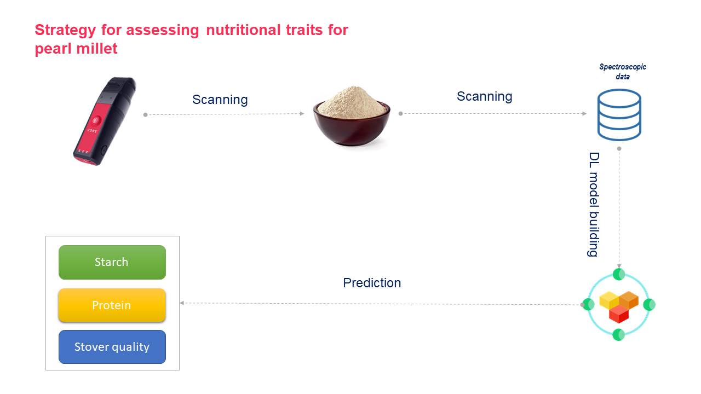

# Estimating millet starch content using NIRS and machine learning

  
  This project is a part of the [Avisa Project](https://www.avisaproject.org/) at [ICRISAT](https://www.icrisat.org). 

#### -- Project Status: [Active]

## Objective
The purpose of this project is estimate pearl millet grain starch content using near-infrared spectroscopy and machine learning/deep learning. Calibration models have been developed will be deployed as rapid phenotyping tools for millet breeders. 

### Partner
* Hone Ag Pty. Ltd.
* https://www.honeag.com/
* Partner contact: Felicity Fraser [felicity@honeag.com]

### Methods Used
* Inferential Statistics
* Machine Learning
* Deep learning
* Data augmentation
* Data Visualization
* Predictive Modeling
* etc.

### Technologies
* Python
* Pandas, jupyter, Numpy
* Scipy, Matplotlib
* Scikit-Learn
* Keras
* Tensorflow
* etc. 

## Project Description
* Measure oleic acid content on 300 samples of pearl millet
* Scan the same samples to record spectroscopic data covering more than 1000 
* Augment data by creating some distortions
* Preprocess the data (filtering, derivating, smoothing, etc)
* Develop ML/DL model architecture
* Train the model
* Make predictions
* Deploy the model

## Needs of this project

- frontend development for deployment
- data exploration/descriptive statistics
- data processing/cleaning
- statistical modeling
- writeup/reporting
- etc. (be as specific as possible)

## Getting Started

1. Clone this repo (for help see this [tutorial](https://www.github.com/adamavip/starch-nirs-model/)).
2. Raw Data is being kept [here](https://www.github.com/adamavip/starch-nirs-model/tree/main/data) within this repo.

    *If using offline data mention that and how they may obtain the data from the froup)*
    
3. Data processing/transformation scripts are being kept [here](https://www.github.com/adamavip/starch-nirs-model/tree/main/src/)
4. etc...

*If your project is well underway and setup is fairly complicated (ie. requires installation of many packages) create another "setup.md" file and link to it here*  

## Featured Notebooks/Analysis/Deliverables
* [Notebook](https://www.github.com/adamavip/starch-nirs-model/tree/main/examples)

## Contributing Members
Maintener: [Adama Ndour](https://github.com/adamavip)

**Others**

|Name     |  Slack Handle   | 
|---------|-----------------|
|[Adama Ndour](https://github.com/adamavip)| @adamavip        |
|[Krithika Anbazhagan](https://github.com/krithika17) |     @krithika    |

## Contact
Reach out me 

  

